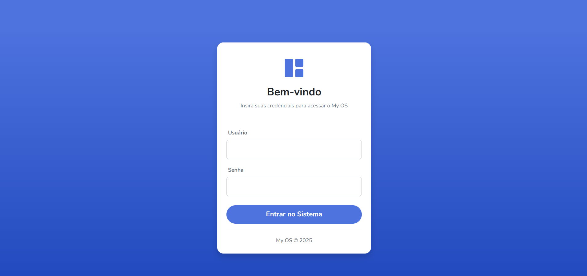
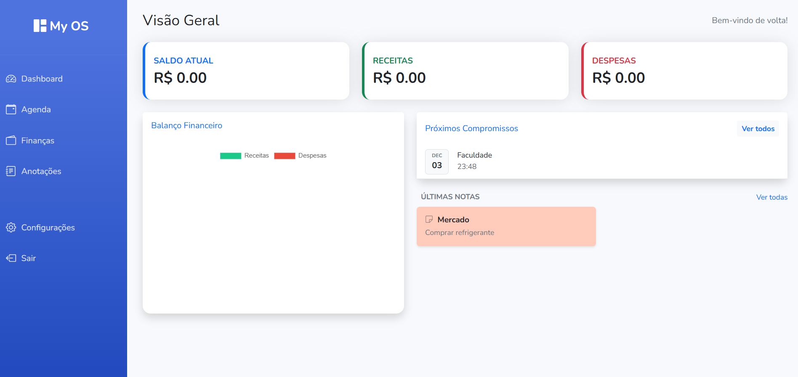
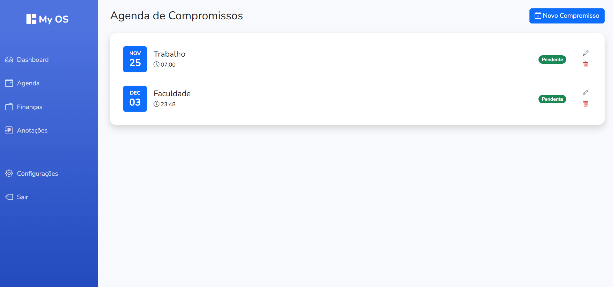
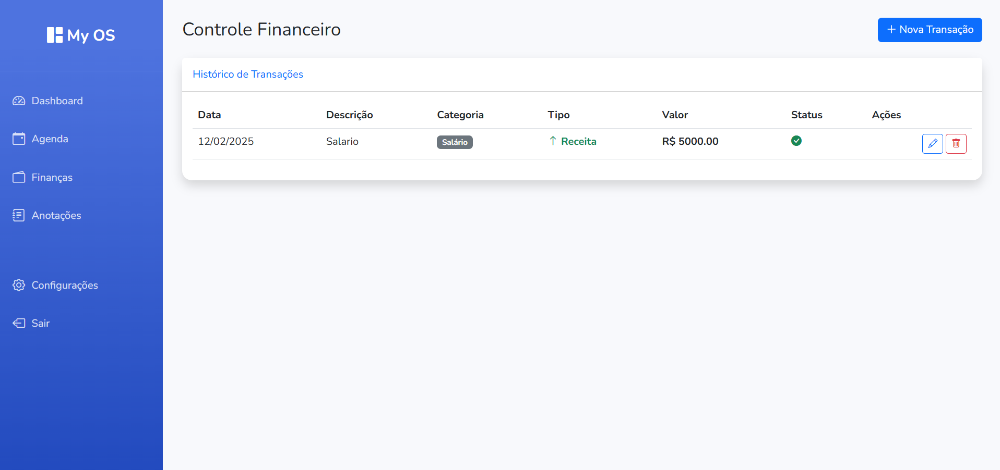
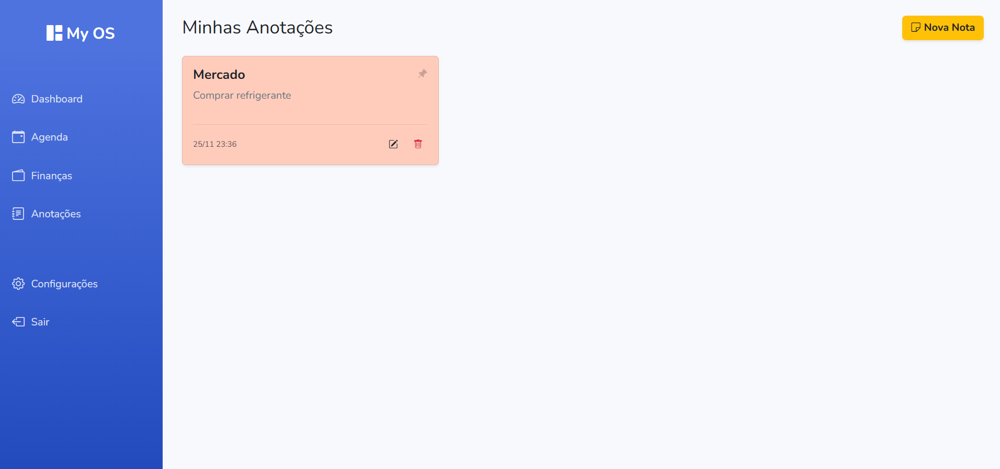
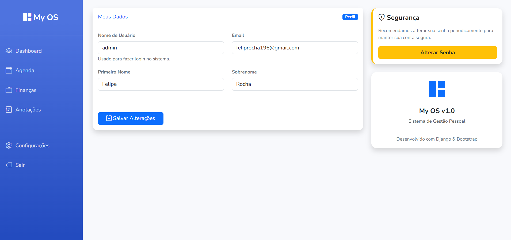

# 📅 Dashboard Agenda – Sistema Completo de Gerenciamento de Contatos

Um sistema completo de  **agenda de contatos** , desenvolvido com foco em  **boas práticas** ,  **organização de código** , **testabilidade** e  **padrões profissionais** , ideal para demonstrar habilidades em  **Django** ,  **CRUDs completos** ,  **autenticação** , **templates reutilizáveis** e  **arquitetura limpa** .

Este projeto foi construído como parte do meu desenvolvimento em  **Django** , com objetivo de apresentar domínio real em desenvolvimento backend e frontend integrado no framework.

---

## 🚀 **Tecnologias Utilizadas**

* **Python 3.12+**
* **Django 5+**
* **SQLite (padrão, mas compatível com MySQL/PostgreSQL)**
* **HTML5, CSS3 e Bootstrap 5**
* **Django Templating Engine**
* **Django ORM**
* **Testes automatizados com Django Test Framework**

---

## 🧩 **Principais Funcionalidades**

### ✔️ Autenticação

* Login e logout seguros
* Proteção de rotas
* Sessões do Django

### ✔️ CRUD Completo de Contatos

* Criar, visualizar, editar e excluir contatos
* Upload de imagem do contato
* Campos como nome, email, telefone, descrição e categoria

### ✔️ Dashboard Profissional

* Interface moderna usando Bootstrap
* Layout limpo e responsivo
* Navegação intuitiva

### ✔️ Sistema de Categorias

* Organização dos contatos por categorias personalizadas
* Listagem separada por categoria

### ✔️ Testes Automatizados

* Testes de formulário
* Testes de views
* Testes de autenticação
* Validação de campos obrigatórios

---

## 🏗️ **Arquitetura do Projeto**

O projeto segue uma estrutura simples e organizada:

<pre class="overflow-visible!" data-start="1903" data-end="2297">

<code class="whitespace-pre!">DashboardAgenda/
│
├── agenda/
│   ├── core/               # Aplicação principal com views, forms e urls
│   ├── templates/          # Templates HTML organizados por telas
│   ├── static/             # Arquivos estáticos, CSS e imagens
│   ├── tests/              # Testes automatizados
│   └── ...
│
├── media/                  # Uploads dos usuários
├── manage.py
└── requirements.txt
</code>

</pre>

Pontos fortes:

* Views organizadas e simplificadas
* Reutilização de templates
* Forms explícitos e validados
* Testes garantindo estabilidade

---

## ⚙️ **Como Rodar o Projeto**

### 1. Clone o repositório

<pre class="overflow-visible!" data-start="2508" data-end="2599">

<code class="whitespace-pre! language-bash">git clone https://github.com/SEU-USUARIO/DashboardAgenda.git
cd DashboardAgenda
</code>

</pre>

### 2. Crie um ambiente virtual

<pre class="overflow-visible!" data-start="2634" data-end="2735">

<code class="whitespace-pre! language-bash">python -m venv venv
source venv/bin/activate  # Linux
venv\Scripts\activate     # Windows
</code>

</pre>

### 3. Instale as dependências

<pre class="overflow-visible!" data-start="2769" data-end="2812">

<code class="whitespace-pre! language-bash">pip install -r requirements.txt
</code>

</pre>

### 4. Realize as migrações

<pre class="overflow-visible!" data-start="2843" data-end="2879">

<code class="whitespace-pre! language-bash">python manage.py migrate
</code>

</pre>

### 5. Execute o servidor

<pre class="overflow-visible!" data-start="2908" data-end="2946">

<code class="whitespace-pre! language-bash">python manage.py runserver
</code>

</pre>

Acesse em:

👉 **[http://127.0.0.1:8000]()**

---

## 🧪 **Como executar os testes**

<pre class="overflow-visible!" data-start="3031" data-end="3064">

<code class="whitespace-pre! language-bash">python manage.py test
</code>

</pre>

---

## 📸 **Screenshots**

---

## 🎯 **Objetivo deste Projeto**

Este projeto foi desenvolvido como parte do meu processo de evolução em  **Desenvolvimento Web** , aplicando:

* Django na prática
* Boas práticas de arquitetura
* Testes profissionais
* Padrões de desenvolvimento usados no mercado

Ele tem como foco demonstrar minhas habilidades como **desenvolvedor backend** e minha capacidade de criar aplicações completas com organização, segurança e escalabilidade.

---

## 📌 **Possíveis Melhorias Futuras**

* Paginação de contatos
* Filtros avançados por categoria, nome e data
* API REST com Django Rest Framework
* Exportação de contatos (Excel/PDF)
* Painel administrativo customizado

---

## 👤 **Autor**

**Felipe Rocha**

Desenvolvedor Backend / Full Stack em formação

Apaixonado por tecnologia, qualidade e boas práticas no desenvolvimento de software.
